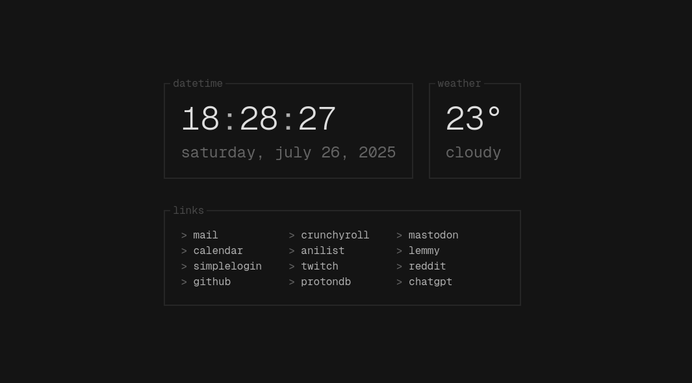

# re-start

a tui-like browser startpage, built with svelte.

Forked from [@refact0r](https://github.com/refact0r/re-start) to customize the startpage for my own usage.

features:

- weather (from open-meteo)
- customizable links
- relatively lightweight (<75kb including fonts)

## installation

### firefox

1. download the latest .xpi file from the `releases` folder.
2. go to the firefox extensions manager (`about:addons`)
3. click the gear icon in the top right.
4. click "Install Add-on From File" and select the .xpi file you downloaded.
5. make sure to click "Add" and "Keep Changes".
(I did not sign the xpi yet, so in order to use it you have to disable "xpinstall.signatures.required" in about:config)

### chrome

1. clone/download this repo.
2. run `npm i` (you must have node.js).
3. run `npm run build`. you should see it create a `dist` folder.
4. go to the chrome extensions manager (`chrome://extensions`).
5. turn on developer mode in the top right.
6. click "Load unpacked" in the top left.
7. select the `dist` folder.

### development / building from source

1. clone/download this repo.
2. run `npm i` (you must have node.js).
3. run `npm run dev` to start in development mode. the page will run at `http://localhost:5173`.
4. run `npm run build` to build for production.
5. run `web-ext build` in dist folder to build the zip/xpi file (must install web-ext via npm before)

## usage tips

- hover your cursor on the top right corner of the startpage, and you should see a settings button appear. click it to configure settings.

